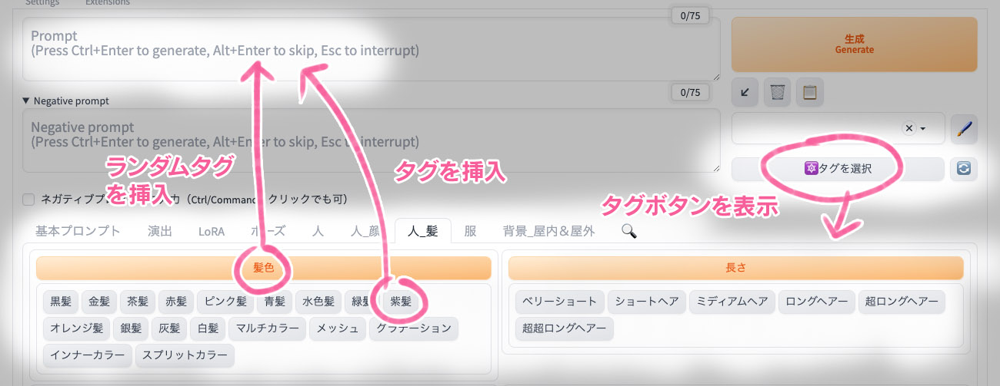
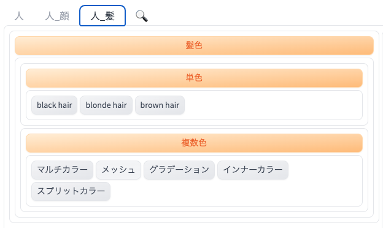

# D2 Prompt Selector

## About

Stable Diffusion webui AUTOMATIC1111版（以下 webui）の機能拡張です。

ぶるぺん氏の [Easy Prompt Selector](https://github.com/blue-pen5805/sdweb-easy-prompt-selector) を自分の好みに作り直しました。




### 基本機能
- タグボタンをクリックするとプロンプト入力欄にタグを挿入する
- オレンジ色のボタン（グループ名）をクリックするとランダムタグを挿入する
- キーボードの `Ctrl`（Macは`Command`） を押しながらクリックするとネガティブプロンプトに挿入する
- 右クリックだとプロンプトから削除される（失敗する時もある）

### 本家 Easy Prompt Selector との違い
- タグファイルを任意の場所に置ける（OneDrive / Dropbox なども可能）
- タグボタンにマウスホバーすると画面下部に内容を表示する（要設定）
- タグ、ボタン名から検索ができる
- タグファイルの並び順を指定できる


## Installation

1. "Extensions" タブを開く
2. "Install from URL" を開く
3. `https://github.com/da2el-ai/sd-d2-prompt-selector` を "URL of the extension repository" に入力
4. "Install" をクリックしてインストールが完了するのを待つ
5. "Installed" を開き、"Apply and restart the UI" をクリック

## Edit Tag file

タグファイルは  `{webuiインストールフォルダ}/extensions/sd-d2-prompt-selector/tags` に置かれています。
設定の `タグファイルを置いたフォルダ` で任意の場所を指定できます。

YAML形式ですのでテキストエディタで編集してください（VisualStudioCode推奨）。

### タグファイルのサンプル
```yaml
髪色:
  単色:
    - black hair
    - blonde hair
    - brown hair
  複数色:
    マルチカラー: multicolored hair
    メッシュ: streaked hair
    グラデーション: gradient hair
    インナーカラー: colored inner hair
    スプリットカラー: split-color hair
```

上記のYAMLは下記のように反映されます。



```yaml
グループ名:
  - タグそのまま
グループ名:
  名前: タグ
```

配列形式と辞書形式の両方が使えます。多層構造もできます。

### タグファイルを編集したら表示されなくなった？

だいたいYAMLの書式ミスです。[Online YAML Parser](https://qiita.com/YumaInaura/items/8e4c08821b6940299a27) などで書式チェックしてみてください。

### 編集したので反映させたい

再読み込みボタンで反映されます。


### タブ（タグファイル切り替えボタン）の並び順を設定したい
タグフォルダにある `__config__.yml` で指定できます。

```yaml
sort:
  - 人
  - 人_顔
  - 人_髪
```

ここに記載していないファイルはファイル名順に並びます。

## Settings

webuiの `Settings > D2 Prompt Selector` から行えます。

### タグフォルダ
タグファイルの置いてあるフォルダをフルパスで指定します。

空欄の時は `{webuiインストールフォルダ}/extensions/sd-d2-prompt-selector/tags` を参照します。

### 検索結果をリアルタイムに表示する
初期状態では【検索ボタンをクリックまたはEnterキーで検索結果を表示】ですが、この設定をONにすると【文字入力に合わせてリアルタイムで検索結果を表示】になります。

### タグボタンにマウスが乗ったら画面下端にプロンプトを表示する
タグの内容をすぐに確認できます。

### 元プロンプトを pngInfo に保存する
ランダムタグを使った時、通常はランダム選択の結果をpnginfoに記録します。この設定がONになっているとランダムプロンプトを記録します。

## Update

- 2024.05.02
  - とりあえず公開

## Licence

MIT
